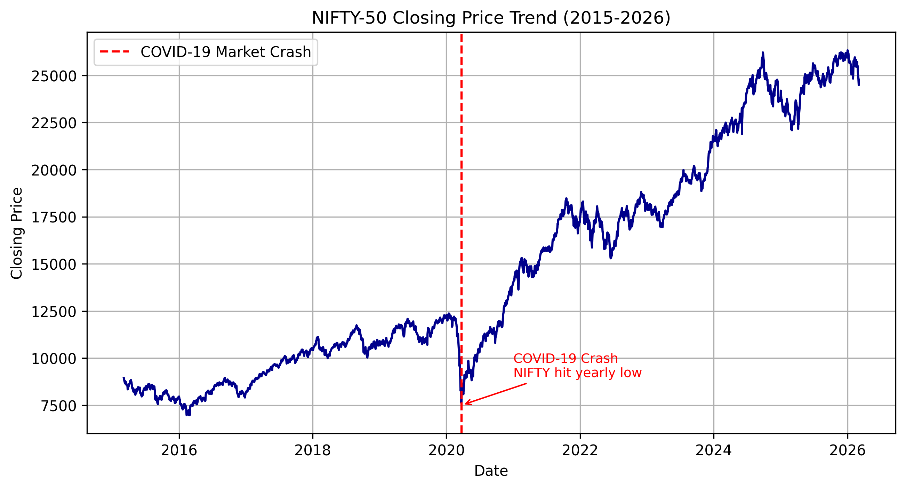
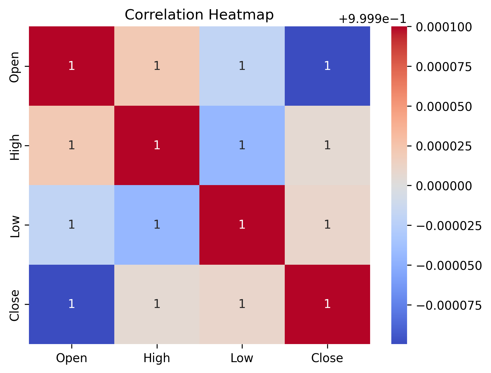
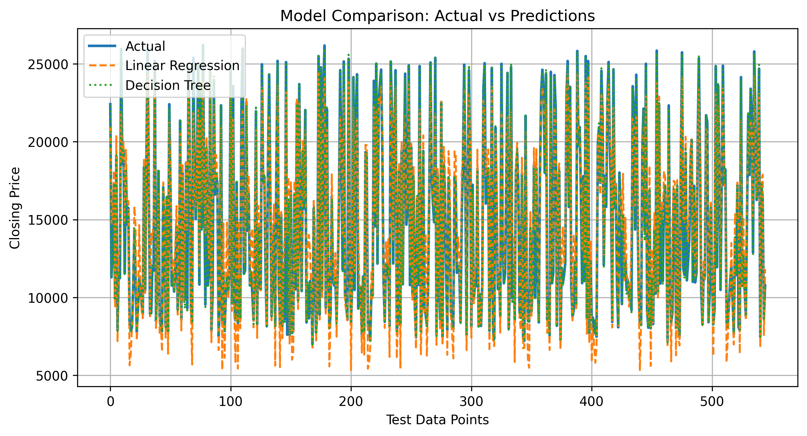
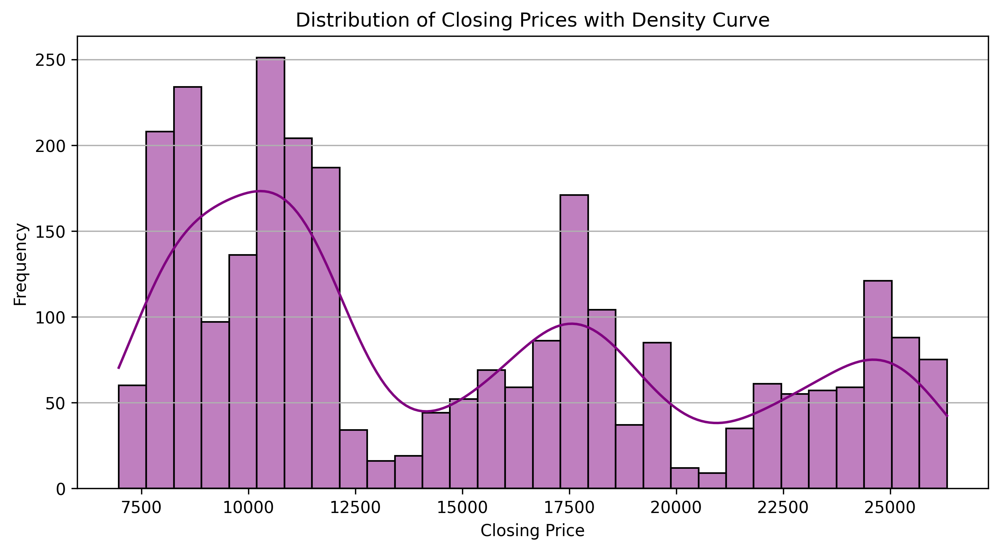

# NIFTY50 Prediction using EDA and Machine Learning

## Overview

This project focuses on analyzing historical NIFTY50 stock market data using Exploratory Data Analysis (EDA) and building machine learning models to predict market trends. It includes a comparative study of multiple models to evaluate their effectiveness in financial prediction.

## Problem Statement

Stock market prediction is inherently complex due to volatility, noise, and multiple influencing factors. The objective of this project is to extract meaningful insights from NIFTY50 data and compare machine learning models to improve predictive understanding.

## Objectives

* Perform data cleaning and preprocessing
* Conduct exploratory data analysis to identify trends and patterns
* Engineer relevant features for modeling
* Build and compare multiple machine learning models
* Evaluate model performance using standard metrics

## Dataset

The dataset consists of historical NIFTY50 stock data containing features such as opening price, closing price, high, low, and trading volume.

Location: `data/final_dataset.xlsx`

## Project Structure

```
.
├── data/
│   └── final_dataset.xlsx
├── notebooks/
│   └── NIFTY50_ML_Prediction.ipynb
├── outputs/
│   ├── daily_market_movement.png
│   ├── yearly_avg_closing.png
│   ├── monthly_avg_closing.png
│   ├── correlation_heatmap.png
│   ├── model_comparison.png
│   └── ...
├── requirements.txt
└── README.md
```

## Methodology

### 1. Data Preprocessing

* Handling missing values
* Converting date columns
* Sorting and structuring time-series data

### 2. Exploratory Data Analysis

* Trend analysis of NIFTY50 over time
* Monthly and yearly average comparisons
* Distribution of closing prices
* Correlation analysis between features

### 3. Feature Engineering

* Extraction of year and month
* Daily price change calculation
* Derived statistical features

### 4. Model Building

The following machine learning models were implemented:

* Linear Regression
* Decision Tree Regressor
* Random Forest Regressor

### 5. Model Evaluation

Models were evaluated using standard regression metrics such as error comparison and trend consistency.

## Model Performance

| Model             | Observation                                                                  |
| ----------------- | ---------------------------------------------------------------------------- |
| Linear Regression | Provides a stable baseline with limited ability to capture non-linear trends |
| Decision Tree     | Captures patterns better but prone to overfitting                            |
| Random Forest     | Shows improved performance with better generalization                        |

## Visual Analysis

### Market Trend



### Correlation Heatmap



### Model Comparison



### Price Distribution



## Visual Insights
Key visualizations highlighting market trends, correlations, model performance and other important  are included in the outputs folder and explained in detail within the notebook.

## How to Run

1. Clone the repository
   git clone <https://github.com/Mandeep2807/NIFTY50-ML-Prediction-EDA>

2. Navigate to the project folder
   cd NIFTY50-ML-Prediction-EDA

3. Install required libraries
   pip install -r requirements.txt

4. Run the notebook
   Open notebooks/NIFTY50_ML_Prediction.ipynb in Jupyter Notebook

## Requirements

* Python 3.x
* pandas
* numpy
* matplotlib
* seaborn
* scikit-learn
* openpyxl

## Results and Insights

* Identified key trends and seasonal patterns in NIFTY50
* Observed correlations between price-related features
* Random Forest performed best among tested models
* Demonstrated the effectiveness of combining EDA with machine learning

## Future Work

* Hyperparameter tuning for improved accuracy
* Implementation of advanced models such as XGBoost and LSTM
* Deployment as a real-time prediction system

## Research Reference

This project is based on the research work titled:
"Exploratory Data Analysis and Comparative Study of Machine Learning Models for NIFTY50 Prediction"

## Author

Mandeep Kumar Roshan

